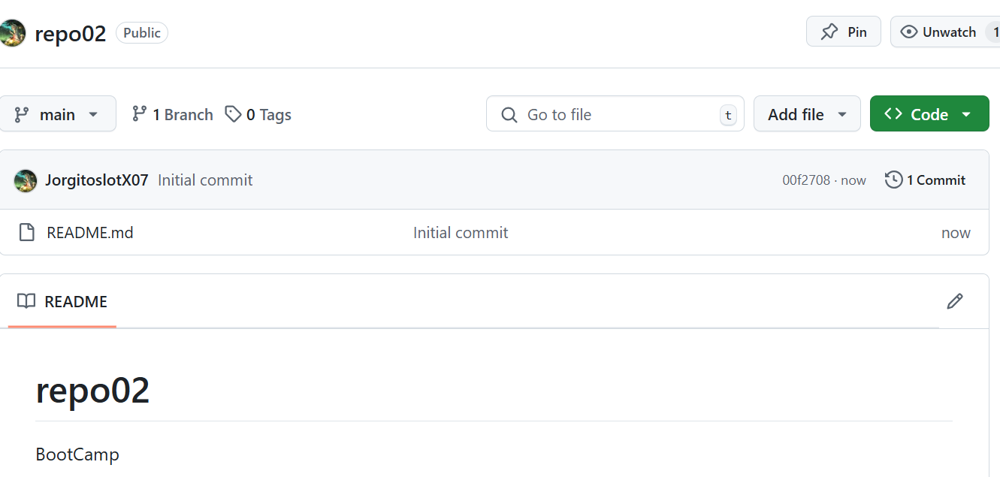
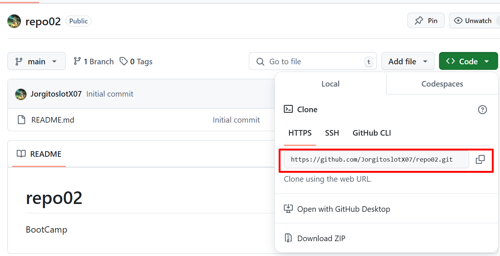
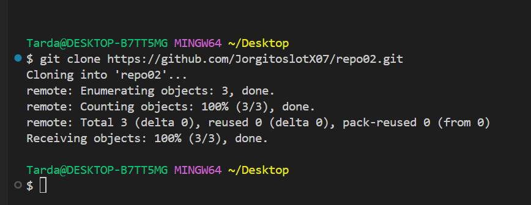
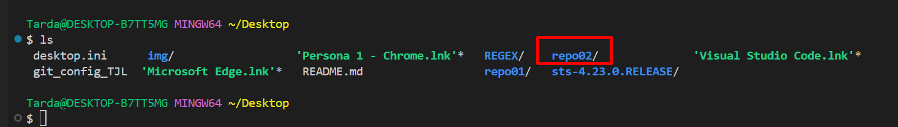
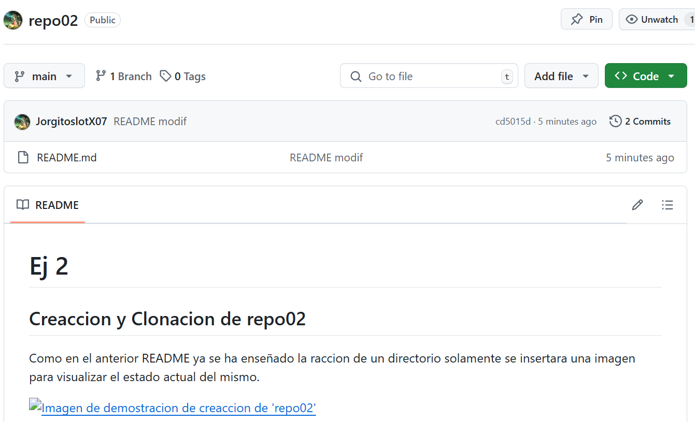

# Ej 2
## Creaccion y Clonacion de repo02 
Como en el anterior README ya se ha enseñado la raccion de un directorio solamente se insertara una imagen para visualizar el estado actual del mismo.

Para realizar una clonacion es muy sencillo, unicamente hay que ir al boton que pone 'Code' -> al apartado 'Local' y copiar la url señalada en la imagin.

Con eso copiado en el portapapeles vamos a la ruta donde queremos clonar el repositorio dentro de CMD y pondremos el siguiente comando.

~~~
git clone "la url copiada"
~~~

### Modificacion y subida de README.md
Dado que para crear el repositorio en mi caso ya tengo creado el README.md lo modificare.
En este caso no hace falta hacer el comando `git add "nombre de fichero"` dado que ya esta traqueado. Despues de que el archivo de agregarlo, o modificarlo hay, abria que hacer un commit. Esto se hace con el comando `git commit -am "mensaje"`.

Y para finalizar habria que hacer el comando `git push` para acabar de subir los cambios a GitHub. 

Si lo hemos seguido todo de manera correcta los cambios de seberian de poner ya en Git.

## Tabla de comandos en Git

| Comando                  | Descripcion                                                                                           |
| :----------------------- | :---------------------------------------------------------------------------------------------------- |
| git init                 | Inicia Git dentro de un repositorio                                                                   |
| git add "fichero"        | Traquea los archivos desconocidos en el repositorio                                                   |
| git commit -am "mensaje" | Envia los cambios y nuevos archivos traqueados al repositorio local final, listos para subir a remoto |
| git push                 | Sube los cambios a la nube                                                                            |
| git pull                 | Baja todos los cambios de la nube                                                                     |
| git clone "url"          | Clona un reposotirio                                                                                  |

